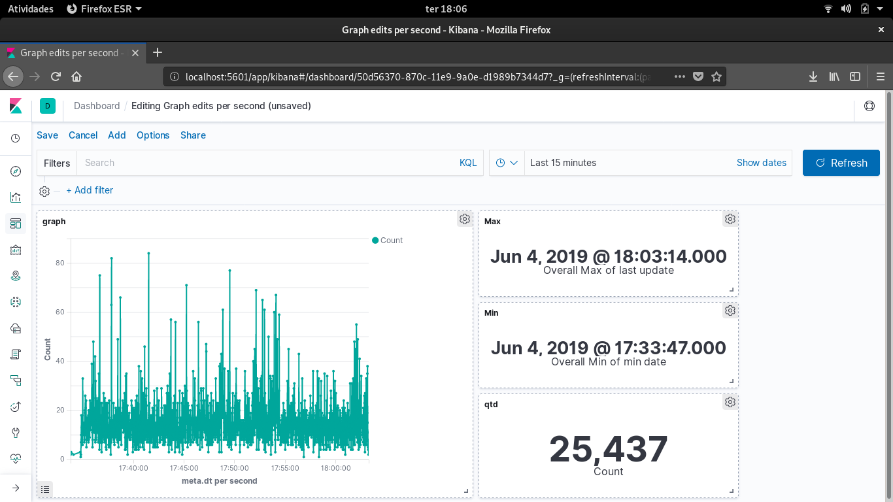

## Lest's go to the best task!!!

# Goal
### Visualize the edits per minute on a web page.
- [X] Using any language or tool build a small web-page.
- [X] Page should display a graph of edits per second while the extract or storage scripts are running.
- [X] If possible the web page should refresh automatically every few seconds to show updated edit counts.
- [X] Feel free to use any framework, tool, or plain HTML you feel comfortable with.

1. Open your console and go to directory that you have downloaded here [a relative link](../readme.md)

```
   cd task4/
```
2. Change the directory data permission.

```
    chmod -R 777 data/*
```

3. Go to docker directory.

```
    cd docker/
```

4. Execute docker compose up.

```
    docker-compose up --build
    
```

5. Access on your browser *localhost:5601*.


6. On your left, click at Dashboard.


7. Go into *Graph edits per second*.




# We gonna use the same task4, so do not stop docker-compose until take a look [a relative link](../task5/readme.md)

## Test
If you wanna test, in directory test

```
cd ../test
```
There is a script.
