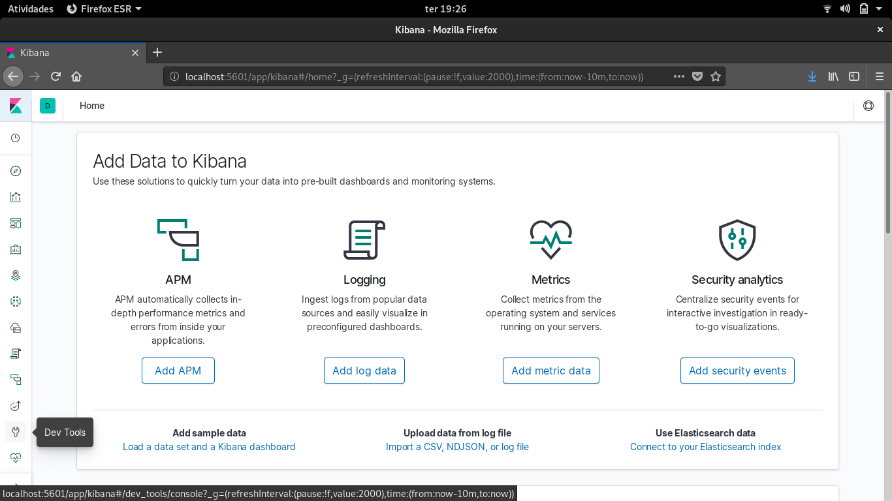

# Goal
### Extend web-based reporting with a query interface that can take arbitrary SQL queries.
- [X] Using any off-the-shelf tool interface into the database to allow arbitrary queries of the Recent Change data.
- [X] Please provide some examples of queries

## Let's query

1. Access on your browser *localhost:5601*



2. on your left, go to Dev Tool


3. Test one of the queries available

```
cd task5/query

```

